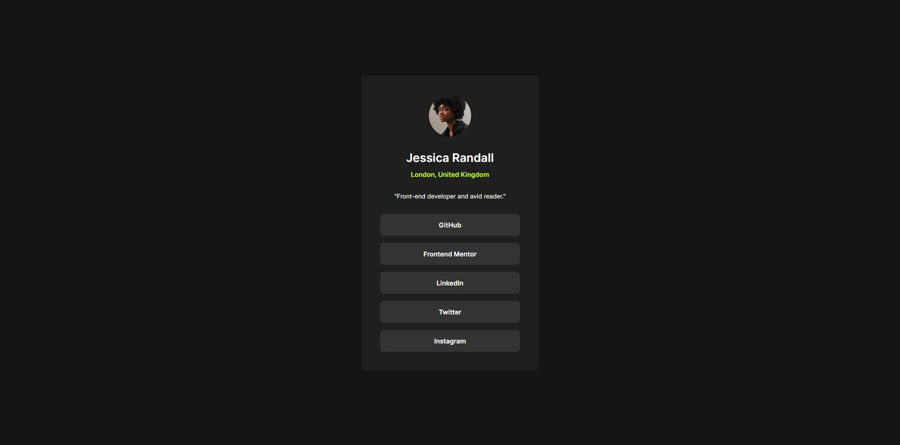
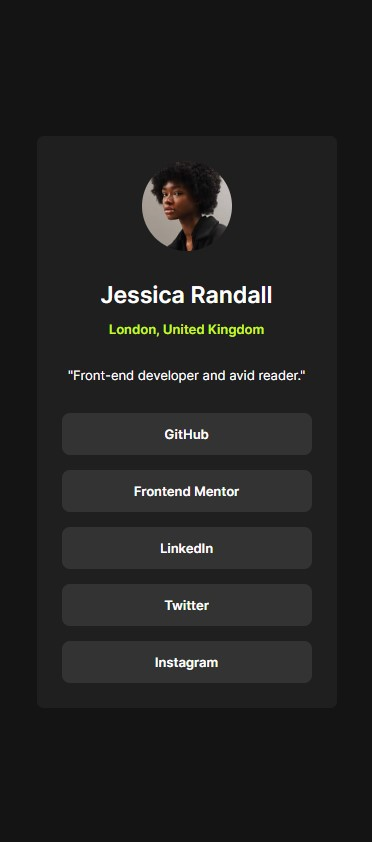

## Table of contents

- [Overview](#overview)
  - [The challenge](#the-challenge)
  - [Screenshots](#screenshot)
  - [Links](#links)
- [My process](#my-process)
  - [Built with](#built-with)
- [Author](#author)

## Overview

### The challenge

Users should be able to:

- View the optimal layout for the app depending on their device's screen size
- See hover states for all interactive elements on the page
- Calculate the correct tip and total cost of the bill per person

### Screenshots

### Links

- Solution URL: [Github](https://github.com/marllonlaborne/social-links-profile)
- Live Site URL: [URL]()

## My process

### Built with

- HTML
- CSS

## Author

- Website - [Marllon Laborne Lima](https://about.me/marllon)
- Frontend Mentor - [@marllonlaborne](https://www.frontendmentor.io/profile/marllonlaborne)